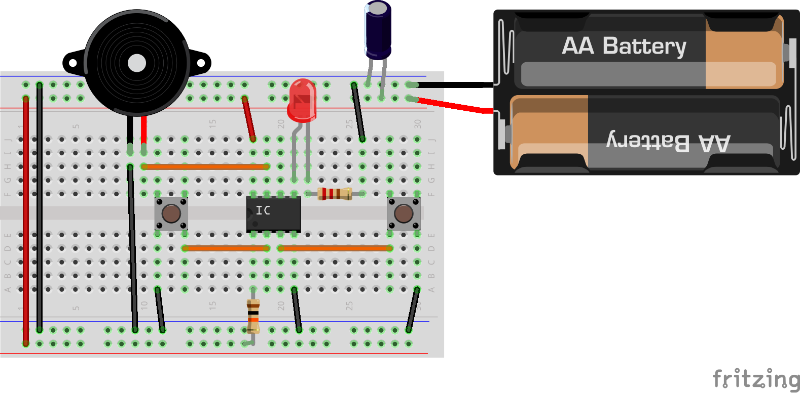

Tea timer for Attiny
====================

Description
-----------

An electronic tea timer, with an attiny.

See some blog posts (in french):

- http://lkdjiin.github.io/blog/2015/10/29/fabriquer-un-sablier-a-the-electronique/
- http://lkdjiin.github.io/blog/2015/12/12/fabriquer-un-sablier-a-the-electronique-2/

Install
-------

Compile the program:

    $ make hex

Load the program into attiny:

    $ make flash

View all make tasks:

    $ make help

Usage
-----

It's so easy. Push left button to start a 3 minutes countdown (default for
green tea), or push right button to start a 5 minutes countdown (default for
black tea).

License
-------

The default license is the *GNU Affero General Public License version 3*, see
`LICENSE.txt`.

If you want to **purchase a commercial license** that suits your needs, please
contact me at xavier.nayrac@gmail.com

Contributing
------------

Contributors must assign all rights to Xavier Nayrac.

Questions and/or Comments
-------------------------

Feel free to email [Xavier Nayrac](mailto:xavier.nayrac@gmail.com) with any
questions, or contact me on [twitter/lkdjiin](https://twitter.com/lkdjiin).
